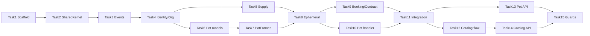

# Feroad Domain MVP Implementation Plan

> **For agentic workers:** REQUIRED SUB-SKILL: Use superpowers:subagent-driven-development (recommended) or superpowers:executing-plans to implement this plan task-by-task. Steps use checkbox (`- [ ]`) syntax for tracking.

**Goal:** feroad-rest-api에 DDD 6 BC(Identity, Organization, Supply, Pot, Booking, Contract)와 이벤트 체인을 구현하여, 카탈로그 예약(경로 A)과 Pot → 1회성 노선 → 예약(경로 B)이 동작하는 MVP 백엔드를 완성한다.

**Architecture:** Axum API → Application Command/Query → Domain Aggregate ← In-memory Repository. BC 간 통신은 `InMemoryEventBus` + 핸들러 등록. MVP는 PostgreSQL 없이 in-memory persistence로 도메인·이벤트 체인을 먼저 검증하고, 이후 migration 단계에서 sqlx를 추가한다.

**Tech Stack:** Rust 2021, Axum 0.8, Tokio, serde, uuid (v7), chrono, thiserror, async-trait

**Spec:** [2026-06-29-feroad-domain-design.md](../specs/2026-06-29-feroad-domain-design.md)

---

## File Map (생성·수정 대상)

| 경로 | 책임 |
|------|------|
| `src/shared_kernel/ids.rs` | 강타입 ID 래퍼 |
| `src/shared_kernel/value_objects.rs` | GeoPoint, ServiceDate, TimeWindow 등 |
| `src/shared_kernel/domain_event.rs` | DomainEvent trait, StoredEvent |
| `src/shared_kernel/event_types.rs` | 이벤트 타입 상수 |
| `src/infrastructure/event_bus.rs` | InMemoryEventBus, EventHandler 등록 |
| `src/infrastructure/app_state.rs` | DI·저장소·버스 단일 조립 |
| `src/identity/domain/model/user.rs` | User aggregate |
| `src/organization/domain/model/organization.rs` | Organization aggregate |
| `src/supply/domain/model/route.rs` | Route + Ephemeral 생성 로직 |
| `src/pot/domain/model/*.rs` | RideIntent, Match, Pot |
| `src/pot/domain/service/compatibility_scorer.rs` | Discover 호환 판정 |
| `src/booking/domain/model/booking.rs` | Booking aggregate |
| `src/contract/domain/model/brokerage_contract.rs` | BrokerageContract |
| `src/*/infrastructure/event_handlers/*.rs` | 교차 BC 이벤트 핸들러 |
| `src/api/v1/pot/*.rs` | Pot REST 핸들러 |
| `src/api/v1/routes/*.rs` | 카탈로그 REST 핸들러 |
| `tests/pot_flow_integration.rs` | 경로 B E2E (in-process) |

**수정:** `Cargo.toml`, `src/lib.rs`, `src/main.rs`, `src/routes/mod.rs`

---

## Task 1: Dependencies & Module Scaffold

**Files:**
- Modify: `Cargo.toml`
- Modify: `src/lib.rs`
- Create: `src/shared_kernel/mod.rs`
- Create: `src/infrastructure/mod.rs`
- Create: `src/identity/mod.rs`, `src/organization/mod.rs`, `src/supply/mod.rs`, `src/pot/mod.rs`, `src/booking/mod.rs`, `src/contract/mod.rs`, `src/api/mod.rs`

- [ ] **Step 1: Add dependencies**

`Cargo.toml` `[dependencies]`에 추가:

```toml
uuid = { version = "1", features = ["v7", "serde"] }
chrono = { version = "0.4", features = ["serde"] }
async-trait = "0.1"
```

- [ ] **Step 2: Register modules in lib.rs**

```rust
pub mod api;
pub mod booking;
pub mod config;
pub mod contract;
pub mod error;
pub mod identity;
pub mod infrastructure;
pub mod organization;
pub mod pot;
pub mod routes;
pub mod shared_kernel;
pub mod supply;
```

각 BC `mod.rs`는 우선 `pub mod domain;` 만 선언.

- [ ] **Step 3: Verify compile**

Run: `cargo check`
Expected: PASS (빈 모듈)

- [ ] **Step 4: Commit**

```bash
git add Cargo.toml Cargo.lock src/
git commit -m "chore: scaffold DDD module layout and dependencies"
```

---

## Task 2: Shared Kernel — IDs & Value Objects

**Files:**
- Create: `src/shared_kernel/ids.rs`
- Create: `src/shared_kernel/value_objects.rs`
- Modify: `src/shared_kernel/mod.rs`
- Test: `tests/shared_kernel_values.rs`

- [ ] **Step 1: Write failing test for GeoPoint distance**

```rust
// tests/shared_kernel_values.rs
use feroad_rest_api::shared_kernel::value_objects::GeoPoint;

#[test]
fn geo_point_distance_meters_within_700m() {
    let a = GeoPoint::new(37.5665, 126.9780).unwrap();
    let b = GeoPoint::new(37.5670, 126.9785).unwrap();
    assert!(a.distance_meters(&b) < 700.0);
}
```

- [ ] **Step 2: Run test — expect FAIL**

Run: `cargo test geo_point_distance -- --nocapture`
Expected: FAIL — `GeoPoint` not found

- [ ] **Step 3: Implement ids.rs**

```rust
use serde::{Deserialize, Serialize};
use uuid::Uuid;

macro_rules! define_id {
    ($name:ident) => {
        #[derive(Debug, Clone, Copy, PartialEq, Eq, Hash, Serialize, Deserialize)]
        pub struct $name(Uuid);

        impl $name {
            pub fn new() -> Self { Self(Uuid::now_v7()) }
            pub fn from_uuid(id: Uuid) -> Self { Self(id) }
            pub fn as_uuid(&self) -> Uuid { self.0 }
        }

        impl std::fmt::Display for $name {
            fn fmt(&self, f: &mut std::fmt::Formatter<'_>) -> std::fmt::Result {
                write!(f, "{}", self.0)
            }
        }
    };
}

define_id!(UserId);
define_id!(OrganizationId);
define_id!(ShuttleId);
define_id!(RouteId);
define_id!(BookingId);
define_id!(ContractId);
define_id!(RideIntentId);
define_id!(PotId);
define_id!(MatchId);
define_id!(StopId);
define_id!(ScheduleId);
```

- [ ] **Step 4: Implement value_objects.rs (GeoPoint, ServiceDate, TimeWindow, Capacity, Money, CorridorSignature)**

```rust
use chrono::{DateTime, NaiveDate, Utc};
use serde::{Deserialize, Serialize};

#[derive(Debug, Clone, Copy, PartialEq, Serialize, Deserialize)]
pub struct GeoPoint {
    pub lat: f64,
    pub lng: f64,
}

impl GeoPoint {
    pub fn new(lat: f64, lng: f64) -> Result<Self, &'static str> {
        if !(-90.0..=90.0).contains(&lat) || !(-180.0..=180.0).contains(&lng) {
            return Err("invalid coordinates");
        }
        Ok(Self { lat, lng })
    }

    /// Haversine distance in meters
    pub fn distance_meters(&self, other: &Self) -> f64 {
        const R: f64 = 6_371_000.0;
        let d_lat = (other.lat - self.lat).to_radians();
        let d_lng = (other.lng - self.lng).to_radians();
        let a = (d_lat / 2.0).sin().powi(2)
            + self.lat.to_radians().cos()
                * other.lat.to_radians().cos()
                * (d_lng / 2.0).sin().powi(2);
        let c = 2.0 * a.sqrt().atan2((1.0 - a).sqrt());
        R * c
    }
}

#[derive(Debug, Clone, Copy, PartialEq, Eq, Serialize, Deserialize)]
pub struct ServiceDate(NaiveDate);

#[derive(Debug, Clone, Copy, PartialEq, Serialize, Deserialize)]
pub struct TimeWindow {
    pub start: DateTime<Utc>,
    pub end: DateTime<Utc>,
}

#[derive(Debug, Clone, Copy, PartialEq, Eq, Serialize, Deserialize)]
pub struct Capacity(pub u16);

#[derive(Debug, Clone, Copy, PartialEq, Eq, Serialize, Deserialize)]
pub struct Money {
    pub amount: i64,
    pub currency: &'static str,
}

#[derive(Debug, Clone, PartialEq, Serialize, Deserialize)]
pub struct CorridorSignature {
    pub origin_zone: String,
    pub destination_zone: String,
    pub time_band: String,
}
```

- [ ] **Step 5: Run tests**

Run: `cargo test geo_point_distance -- --nocapture`
Expected: PASS

- [ ] **Step 6: Commit**

```bash
git add src/shared_kernel/ tests/shared_kernel_values.rs
git commit -m "feat: add shared kernel IDs and value objects"
```

---

## Task 3: Domain Event Infrastructure

**Files:**
- Create: `src/shared_kernel/event_types.rs`
- Create: `src/shared_kernel/domain_event.rs`
- Create: `src/infrastructure/event_bus.rs`
- Test: `tests/event_bus.rs`

- [ ] **Step 1: Write failing event bus test**

```rust
// tests/event_bus.rs
use std::sync::{Arc, Mutex};
use feroad_rest_api::infrastructure::event_bus::{EventBus, EventHandler};
use feroad_rest_api::shared_kernel::domain_event::{DomainEvent, StoredEvent};
use feroad_rest_api::shared_kernel::event_types;
use async_trait::async_trait;

struct Counter(Arc<Mutex<u32>>);

#[async_trait]
impl EventHandler for Counter {
    async fn handle(&self, event: &StoredEvent) -> Result<(), String> {
        if event.event_type == event_types::POT_FORMED {
            *self.0.lock().unwrap() += 1;
        }
        Ok(())
    }
}

#[tokio::test]
async fn event_bus_dispatches_to_handler() {
    let bus = EventBus::new();
    let counter = Arc::new(Mutex::new(0));
    bus.register(Arc::new(Counter(counter.clone()))).await;
    let event = StoredEvent {
        event_type: event_types::POT_FORMED.to_string(),
        payload: "{}".to_string(),
        aggregate_id: "pot-1".to_string(),
    };
    bus.publish(event).await.unwrap();
    assert_eq!(*counter.lock().unwrap(), 1);
}
```

- [ ] **Step 2: Run test — expect FAIL**

Run: `cargo test event_bus_dispatches -- --nocapture`

- [ ] **Step 3: Implement event_types.rs**

```rust
pub const USER_REGISTERED: &str = "user.registered";
pub const POT_FORMED: &str = "pot.formed";
pub const EPHEMERAL_ROUTE_ACTIVATED: &str = "supply.ephemeral_route.activated";
pub const BOOKING_CONFIRMED: &str = "booking.confirmed";
pub const ROUTE_ACTIVATED: &str = "supply.route.activated";
// ... 나머지는 스펙 §7 따라 동일 패턴 추가
```

- [ ] **Step 4: Implement domain_event.rs + event_bus.rs**

`StoredEvent { event_type, payload, aggregate_id }`, `EventHandler` async trait, `EventBus` with `register` + `publish` (순차 핸들러 호출, MVP).

- [ ] **Step 5: Run test — expect PASS**

- [ ] **Step 6: Commit**

```bash
git commit -m "feat: add in-memory domain event bus"
```

---

## Task 4: Identity & Organization (Minimal Aggregates)

**Files:**
- Create: `src/identity/domain/model/user.rs`
- Create: `src/organization/domain/model/organization.rs`
- Create: `src/infrastructure/acl.rs` (stub ports)
- Test: `tests/organization_verification.rs`

- [ ] **Step 1: Write failing test — only verified operator can publish catalog route**

```rust
#[test]
fn unverified_operator_cannot_activate_catalog_route() {
    let org = Organization::new(OrganizationType::Operator);
    assert!(!org.is_verified_operator());
}
```

- [ ] **Step 2: Implement User + Organization aggregates**

`UserStatus`: Pending, Active, Suspended. `OrganizationStatus`: Draft, PendingVerification, Verified, Suspended. `Organization::is_verified_operator()`.

- [ ] **Step 3: ACL stubs in infrastructure/acl.rs**

```rust
#[async_trait::async_trait]
pub trait OperatorVerificationPort: Send + Sync {
    async fn is_verified_operator(&self, org_id: OrganizationId) -> bool;
}

#[async_trait::async_trait]
pub trait UserProfilePort: Send + Sync {
    async fn is_active_user(&self, user_id: UserId) -> bool;
}
```

In-memory impl backed by HashMap stores.

- [ ] **Step 4: Run tests, commit**

```bash
git commit -m "feat: add identity and organization domain models with ACL stubs"
```

---

## Task 5: Supply — Route Aggregate & Catalog

**Files:**
- Create: `src/supply/domain/model/route.rs`
- Create: `src/supply/domain/model/mod.rs`
- Create: `src/supply/application/command/activate_catalog_route.rs`
- Test: `tests/supply_route.rs`

- [ ] **Step 1: Write failing test — catalog route activation**

```rust
#[test]
fn catalog_fixed_route_activates() {
    let mut route = Route::new_catalog_fixed(operator_org_id, " commute ");
    route.add_stop(/* ... */);
    route.add_schedule(/* ... */);
    assert!(route.activate().is_ok());
    assert_eq!(route.status(), RouteStatus::Active);
    assert_eq!(route.origin(), RouteOrigin::Catalog);
}
```

- [ ] **Step 2: Implement Route model**

필드: `id`, `origin: RouteOrigin`, `route_type: RouteType`, `status`, `operator_org_id`, `stops`, `schedules`, `capacity`, `pot_id: Option<PotId>`.

`RouteOrigin::Catalog` | `RouteOrigin::Pot { pot_id }`. `RouteType::Fixed | Flexible | Ephemeral`.

- [ ] **Step 3: Run tests, commit**

```bash
git commit -m "feat: add supply route aggregate for catalog routes"
```

---

## Task 6: Pot — RideIntent, Match, CompatibilityScorer

**Files:**
- Create: `src/pot/domain/model/ride_intent.rs`
- Create: `src/pot/domain/model/match_record.rs`
- Create: `src/pot/domain/service/compatibility_scorer.rs`
- Test: `tests/pot_compatibility.rs`, `tests/pot_match.rs`

- [ ] **Step 1: Write failing compatibility test**

```rust
#[test]
fn intents_within_20_min_and_700m_are_compatible() {
    let a = sample_intent(departure_hour: 8, 0);
    let b = sample_intent(departure_hour: 8, 15);
    let score = CompatibilityScorer::score(&a, &b);
    assert!(score.is_compatible());
}
```

- [ ] **Step 2: Implement RideIntent + MatchRecord**

`RideIntent::post(...)`, `MatchRecord::like(from, to)`, mutual detection helper.

- [ ] **Step 3: Implement CompatibilityScorer**

스펙 §6.4 조건: 동일 service_date, ±20분, 700m, 인원 합 ≤ max_capacity.

- [ ] **Step 4: Write failing mutual match test**

```rust
#[test]
fn mutual_like_creates_match() {
    let result = MatchRecord::record_like(intent_a, intent_b, existing_likes);
    assert!(result.is_mutual());
}
```

- [ ] **Step 5: Run all pot tests, commit**

```bash
git commit -m "feat: add pot ride intent, match, and compatibility scorer"
```

---

## Task 7: Pot — Pot Aggregate & PotFormed Event

**Files:**
- Create: `src/pot/domain/model/pot.rs`
- Create: `src/pot/application/command/like_intent.rs`
- Create: `src/pot/application/command/post_ride_intent.rs`
- Test: `tests/pot_formed.rs`

- [ ] **Step 1: Write failing PotFormed test**

```rust
#[test]
fn pot_forms_when_min_members_reached() {
    let mut pot = Pot::create_from_mutual_match(member_a, member_b);
    pot.add_member(member_c); // still below min=2? adjust: min_members=2, two members enough
    let events = pot.try_form(min_members: 2);
    assert!(events.iter().any(|e| e.event_type == event_types::POT_FORMED));
    assert_eq!(pot.status(), PotStatus::Formed);
}
```

- [ ] **Step 2: Implement Pot aggregate**

상태: Gathering → Formed → SpawningRoute → RouteSpawned → Converted. `try_form()` 시 `PotFormed` 이벤트 기록.

- [ ] **Step 3: Implement post_ride_intent + like_intent commands**

`like_intent`: Match 상호 성립 시 Pot 생성 또는 기존 Pot에 멤버 추가 → `try_form()` 호출.

- [ ] **Step 4: Run tests, commit**

```bash
git commit -m "feat: add pot aggregate and PotFormed event emission"
```

---

## Task 8: Supply — Spawn Ephemeral Route from Pot

**Files:**
- Create: `src/supply/application/command/spawn_ephemeral_route_from_pot.rs`
- Create: `src/supply/infrastructure/event_handlers/pot_formed_handler.rs`
- Test: `tests/ephemeral_route.rs`

- [ ] **Step 1: Write failing ephemeral route test**

```rust
#[test]
fn spawn_ephemeral_route_from_pot_snapshot() {
    let pot = formed_pot_fixture();
    let route = spawn_ephemeral_route_from_pot(&pot).unwrap();
    assert_eq!(route.route_type(), RouteType::Ephemeral);
    assert_eq!(route.origin(), RouteOrigin::Pot { pot_id: pot.id() });
    assert!(route.stops().iter().any(|s| s.stop_type == StopType::Pickup));
    assert_eq!(route.status(), RouteStatus::Active);
}
```

- [ ] **Step 2: Implement spawn command**

Pot 멤버 Intent 스냅샷에서 pickup/dropoff stops + 1개 schedule 생성. `operator_org_id: None`. 즉시 `activate()`.

- [ ] **Step 3: Implement pot_formed_handler**

`PotFormed` payload deserialize → `spawn_ephemeral_route_from_pot` → `EphemeralRouteActivated` publish.

- [ ] **Step 4: Test invariant — one active ephemeral per pot_id**

```rust
#[test]
fn rejects_second_active_ephemeral_for_same_pot() { /* ... */ }
```

- [ ] **Step 5: Run tests, commit**

```bash
git commit -m "feat: spawn ephemeral route on PotFormed event"
```

---

## Task 9: Booking & Contract Aggregates

**Files:**
- Create: `src/booking/domain/model/booking.rs`
- Create: `src/contract/domain/model/brokerage_contract.rs`
- Create: `src/booking/application/command/request_catalog_booking.rs`
- Create: `src/booking/infrastructure/event_handlers/ephemeral_route_activated_handler.rs`
- Create: `src/contract/infrastructure/event_handlers/booking_confirmed_handler.rs`
- Test: `tests/booking_contract.rs`

- [ ] **Step 1: Write failing booking test**

```rust
#[test]
fn pot_sourced_booking_auto_confirms() {
    let booking = Booking::from_pot_member(pot_id, route_id, user_id, pickup, dropoff);
    booking.confirm().unwrap();
    assert_eq!(booking.status(), BookingStatus::Confirmed);
    assert_eq!(booking.source(), BookingSource::Pot);
}
```

- [ ] **Step 2: Implement Booking aggregate**

`BookingSource::Catalog | Pot | Corporate`. Catalog Flexible → PendingApproval, 나머지 즉시 confirm 가능.

- [ ] **Step 3: Implement ephemeral_route_activated_handler**

멤버마다 Booking 생성 → `confirm()` → `BookingConfirmed` publish.

- [ ] **Step 4: Implement BrokerageContract + booking_confirmed_handler**

`brokerage_type: pot_ephemeral | catalog`, 스냅샷 필드 저장, `ContractActivated` 발행.

- [ ] **Step 5: Run tests, commit**

```bash
git commit -m "feat: add booking and contract with cross-BC event handlers"
```

---

## Task 10: Pot — EphemeralRouteActivated Handler

**Files:**
- Create: `src/pot/infrastructure/event_handlers/pot_route_spawned_handler.rs`
- Test: `tests/pot_route_spawned.rs`

- [ ] **Step 1: Write failing test**

```rust
#[tokio::test]
async fn pot_route_spawned_handler_sets_route_id() {
    let mut pot = formed_pot_in_store();
    handler.handle(ephemeral_route_activated_event(pot.id(), route_id)).await.unwrap();
    let updated = pot_repo.get(pot.id()).unwrap();
    assert_eq!(updated.route_id(), Some(route_id));
    assert_eq!(updated.status(), PotStatus::RouteSpawned);
}
```

- [ ] **Step 2: Implement handler**

- [ ] **Step 3: Run test, commit**

```bash
git commit -m "feat: update pot with route_id on EphemeralRouteActivated"
```

---

## Task 11: AppState & Event Handler Registration

**Files:**
- Create: `src/infrastructure/app_state.rs`
- Modify: `src/main.rs`
- Test: `tests/pot_flow_integration.rs`

- [ ] **Step 1: Write failing integration test (경로 B 전체)**

```rust
// tests/pot_flow_integration.rs
#[tokio::test]
async fn pot_flow_creates_ephemeral_route_booking_and_contract() {
    let app = TestApp::spawn().await;

    let intent_a = app.post_intent(user_a, /* coords, time */).await;
    let intent_b = app.post_intent(user_b, /* compatible */).await;

    app.like_intent(user_a, intent_b.id).await;
    app.like_intent(user_b, intent_a.id).await;

    app.dispatch_events().await;

    let pot = app.get_pot_for_intent(intent_a.id).await;
    assert_eq!(pot.status, "route_spawned");

    let route = app.get_ephemeral_route(pot.route_id.unwrap()).await;
    assert_eq!(route.route_type, "ephemeral");

    let bookings = app.list_bookings_for_pot(pot.id).await;
    assert_eq!(bookings.len(), 2);
    assert!(bookings.iter().all(|b| b.status == "confirmed"));

    let contracts = app.list_contracts_for_bookings(&bookings).await;
    assert_eq!(contracts.len(), 2);
    assert!(contracts.iter().all(|c| c.brokerage_type == "pot_ephemeral"));
}
```

- [ ] **Step 2: Implement AppState**

HashMap stores per aggregate, `EventBus`, handler registration in `AppState::new()`:

1. `pot_formed_handler`
2. `ephemeral_route_activated_handler` (booking)
3. `pot_route_spawned_handler`
4. `booking_confirmed_handler`

- [ ] **Step 3: Implement TestApp helper**

- [ ] **Step 4: Run integration test — expect PASS**

Run: `cargo test pot_flow_creates -- --nocapture`

- [ ] **Step 5: Commit**

```bash
git commit -m "feat: wire event handlers and pot flow integration test"
```

---

## Task 12: Catalog Flow Integration (경로 A)

**Files:**
- Create: `src/booking/application/command/request_catalog_booking.rs` (완성)
- Test: `tests/catalog_flow_integration.rs`

- [ ] **Step 1: Write failing catalog flow test**

```rust
#[tokio::test]
async fn catalog_booking_creates_contract() {
    let app = TestApp::spawn().await;
    let route = app.create_and_activate_catalog_route(operator).await;
    let booking = app.request_catalog_booking(rider, route.id).await;
    app.dispatch_events().await;
    let contract = app.get_contract_for_booking(booking.id).await;
    assert_eq!(contract.brokerage_type, "catalog");
}
```

- [ ] **Step 2: Implement catalog booking command + handler wiring**

- [ ] **Step 3: Run test, commit**

```bash
git commit -m "feat: add catalog booking flow integration test"
```

---

## Task 13: REST API — Pot Endpoints

**Files:**
- Create: `src/api/v1/mod.rs`
- Create: `src/api/v1/pot/handlers.rs`
- Create: `src/api/v1/pot/dto.rs`
- Modify: `src/routes/mod.rs`
- Test: `tests/pot_api.rs`

- [ ] **Step 1: Write failing API test**

```rust
#[tokio::test]
async fn post_intent_returns_201() {
    let app = spawn_test_server().await;
    let res = app.post("/api/v1/pot/intents").json(&intent_body).await;
    assert_eq!(res.status(), 201);
}
```

- [ ] **Step 2: Implement handlers**

스펙 §8 Pot API 전부. `AppState`를 Axum `State`로 주입.

- [ ] **Step 3: Run API tests, commit**

```bash
git commit -m "feat: add pot REST API endpoints"
```

---

## Task 14: REST API — Catalog Routes

**Files:**
- Create: `src/api/v1/routes/handlers.rs`
- Test: `tests/catalog_api.rs`

- [ ] **Step 1: Implement GET /api/v1/routes (catalog only, Ephemeral 제외)**

- [ ] **Step 2: Implement POST /api/v1/routes/{id}/bookings**

- [ ] **Step 3: API tests + commit**

```bash
git commit -m "feat: add catalog routes and booking API"
```

---

## Task 15: BC Boundary Guard & Docs Update

**Files:**
- Create: `tests/bc_boundary.rs`
- Modify: `docs/superpowers/specs/README.md`

- [ ] **Step 1: Boundary test — pot domain does not import supply domain**

```rust
#[test]
fn pot_domain_has_no_supply_dependency() {
    let pot_lib = std::fs::read_to_string("src/pot/domain/mod.rs").unwrap();
    assert!(!pot_lib.contains("crate::supply"));
}
```

- [ ] **Step 2: Run full test suite**

Run: `cargo test`
Expected: all PASS

- [ ] **Step 3: Update specs README with plan link**

- [ ] **Step 4: Commit**

```bash
git commit -m "test: add BC boundary guards and link implementation plan"
```

---

## Self-Review (Spec Coverage)

| 스펙 요구 | Task |
|-----------|------|
| Shared Kernel IDs/VO | Task 2 |
| Event bus + handler | Task 3, 11 |
| Identity / Organization | Task 4 |
| Supply Catalog Route | Task 5 |
| Ephemeral Route from Pot | Task 8 |
| Pot RideIntent/Match/Pot | Task 6, 7 |
| CompatibilityScorer | Task 6 |
| Booking (catalog + pot) | Task 9, 12 |
| Contract | Task 9 |
| 경로 B 이벤트 체인 | Task 11 |
| 경로 A 이벤트 체인 | Task 12 |
| Pot API §8 | Task 13 |
| Catalog API §8 | Task 14 |
| BC 경계 검증 §12 | Task 15 |
| ACL ports | Task 4 (stub), used in Task 5/13 |

**의도적 MVP 제외:** PostgreSQL persistence (후속 plan), Payment/RFQ/Notification.

---

## Suggested Execution Order

