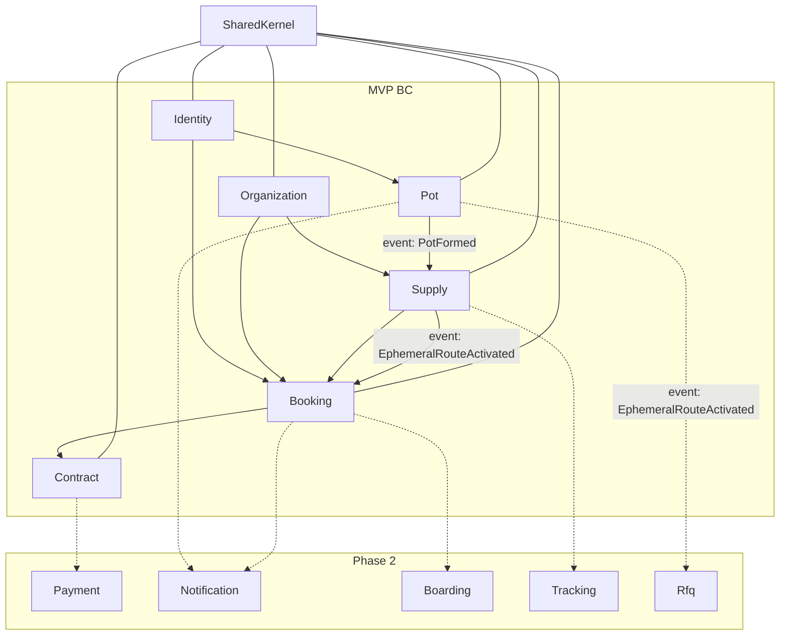
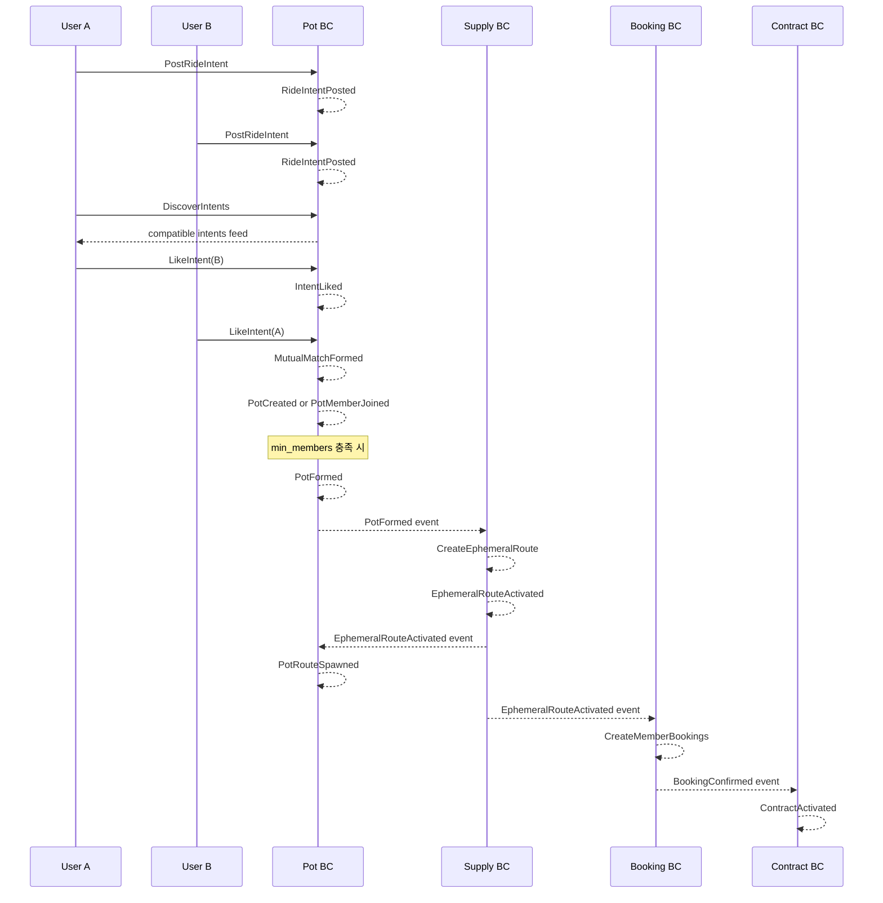

# Feroad 기본 도메인 설계

최종 검토: 2026-06-29

## 개요

Feroad(페로드)는 셔틀버스 운송 **중개** 플랫폼입니다. Event-driven Architecture(EDA)와 Domain-Driven Design(DDD)를 중심으로, 이용자·업체·노선·예약·계약·동행 매칭(Pot) 도메인을 정의합니다.

## 설계 전제

| 항목 | 결정 |
|------|------|
| 비즈니스 모델 | 통합 마켓플레이스 (검색·비교·예약·결제 비전, MVP는 중개 핵심만) |
| Mobiall 관계 | 완전 신규 — mobiall-backend의 DDD/EDA 패턴 참고만 |
| MVP 범위 | 이용자·업체·노선·예약·계약·**Pot 동행 매칭** |
| 액터 모델 | B2B2C — 기업/단체 + 개인 이용자 + 셔틀 업체 |
| 수요 채널 | ① 공급 카탈로그 직접 예약 ② **Pot 기반 동행 매칭 후 중개** |

---

## 바운디드 컨텍스트 맵



### 통합 규칙

- `API → Application → Domain ← Infrastructure` 의존 방향
- BC 간 직접 repository/aggregate import 금지 — **도메인 이벤트** 또는 **ACL port**만
- 동기 조회: ACL port / read model
- 비동기 반응: domain event + outbox

---

## Shared Kernel

### 식별자

`UserId`, `OrganizationId`, `ShuttleId`, `RouteId`, `BookingId`, `ContractId`, `RideIntentId`, `PotId`, `MatchId`

### 값 객체

`Money`, `GeoPoint`, `GeoZone`, `ServiceDate`, `TimeWindow`, `Capacity`, `CorridorSignature`

### 이벤트 인프라

`DomainEvent` trait, `EventType` enum, `OutboxEventPublisher` 인터페이스

---

## 1. Identity

인증·사용자 프로필·역할.

| Aggregate | 상태 | 이벤트 |
|-----------|------|--------|
| `User` | `pending` → `active` → `suspended` | `UserRegistered`, `UserActivated` |

역할: `Rider`, `CorporateMember`, `OperatorAdmin`, `Driver`, `PlatformAdmin`

---

## 2. Organization

기업(수요)·셔틀 업체(공급)·플랫폼 운영 주체.

| Aggregate | 상태 | 이벤트 |
|-----------|------|--------|
| `Organization` | `draft` → `pending_verification` → `verified` → `suspended` | `OrganizationCreated`, `OrganizationVerified` |
| `OrganizationMembership` | `invited` → `active` → `removed` | `MemberAdded`, `MemberRemoved` |

- `OrganizationType`: `Corporate`, `Operator`, `Platform`
- Supply BC는 `OperatorVerificationPort`로 verified 업체만 노선 게시 허용

---

## 3. Supply (공급 카탈로그)

셔틀 업체가 등록하는 운행 상품 + **Pot에서 파생되는 1회성 노선**.

| Aggregate | 상태 | 이벤트 |
|-----------|------|--------|
| `Shuttle` | `draft` → `active` → `retired` | `ShuttleRegistered`, `ShuttleActivated` |
| `Route` | `draft` → `active` → `inactive` → `archived` | `RouteCreated`, `RouteActivated` |
| `RouteSchedule` | Route 종속 | `ScheduleAdded` |
| `Stop` | Route 종속 | `StopAdded` |

### Route 분류

| `RouteOrigin` | 설명 | 카탈로그 노출 |
|---------------|------|---------------|
| `Catalog` | 업체가 직접 등록한 정기/맞춤 노선 | O (`Fixed` / `Flexible`) |
| `Pot` | Pot 매칭 성립 시 **자동 생성되는 1회성 노선** | X (비공개) |

- `RouteType`: `Fixed`(정기), `Flexible`(맞춤), **`Ephemeral`(1회성)**
- 카탈로그 경로: `RouteOrigin::Catalog` + `Route(status=active)`가 마켓플레이스 노출 단위
- Pot 경로: `RouteOrigin::Pot { pot_id }` + `RouteType::Ephemeral` — **해당 Pot 전용, 운행 1회 후 archive**

### Ephemeral Route (1회성 노선)

Pot BC가 `PotFormed`를 발행하면 Supply BC가 이벤트 핸들러로 **1회성 노선을 생성**합니다. 기존 카탈로그 노선을 검색·매칭하는 것이 아니라, Pot 멤버의 이동 수요를 물리적 노선 aggregate로 구체화합니다.

| 필드 | 설명 |
|------|------|
| `pot_id` | 생성 원인 Pot |
| `origin` | `RouteOrigin::Pot` |
| `route_type` | `Ephemeral` |
| `service_date` | Pot 공통 이용일 |
| `departure_time` | Pot 합의 출발 시각 |
| `stops` | 멤버별 pickup(`StopType::Pickup`) + 공통/개별 dropoff |
| `schedule` | 1개의 `RouteSchedule` (해당 일자 1회 운행) |
| `capacity` | Pot `max_capacity` (= 멤버 총 인원 상한) |
| `operator_org_id` | 선택 — MVP는 `None`, 2차 RFQ로 업체 배정 |

| 상태 | 설명 |
|------|------|
| `draft` | 생성 직후 (정류장·스케줄 조립 중) |
| `active` | 예약·중개 가능 |
| `completed` | 운행 완료 |
| `archived` | 1회 운행 종료 후 자동 종료 |

| 이벤트 |
|--------|
| `EphemeralRouteCreated`, `EphemeralRouteActivated`, `EphemeralRouteCompleted`, `EphemeralRouteArchived` |

불변식:
- `Ephemeral` 노선은 카탈로그 검색·Discover API에 노출되지 않음
- `pot_id`당 활성 `Ephemeral` 노선은 최대 1개
- `service_date` 경과 시 `active` → `archived` (스케줄러 또는 이벤트)
- Pot에서 생성된 노선은 업체 수동 수정 불가 — 멤버 Intent 스냅샷 기반으로만 생성

---

## 4. Pot (동행 매칭) — 신규

Tinder식 **상호 관심 매칭**으로, 특정 시간대에 비슷한 출발·도착을 원하는 이용자를 하나의 **Pot(동행 그룹)** 으로 묶습니다. Mobiall의 Match Pool / RiderRequest / LightGroup 복잡도는 참고만 하고, Feroad MVP는 Pot UX에 맞게 단순화합니다.

### 개념

| 용어 | 설명 |
|------|------|
| **RideIntent** | 이용자 1명의 이동 카드 — 언제, 어디서, 어디로 |
| **Like** | 다른 Intent에 관심 표시 (Tinder 오른쪽 스와이프) |
| **Match** | 양쪽이 서로 Like → 매칭 성립 |
| **Pot** | 매칭된 Intent들이 모이는 동행 그룹 |
| **PotFormed** | 최소 인원 충족, 업체 중개 단계로 진행 가능 |

### Aggregate

#### RideIntent

이용자가 올리는 이동 수요 카드.

| 필드 | 설명 |
|------|------|
| `user_id` | 작성자 |
| `origin` | 출발 좌표 |
| `destination` | 도착 좌표 |
| `service_date` | 이용일 |
| `departure_time` | 희망 출발 시각 |
| `passenger_count` | 본인 포함 인원 |
| `corporate_org_id` | 선택 — 기업 소속 이용 시 |
| `pot_id` | 매칭 후 소속 Pot (없으면 null) |

| 상태 | 설명 |
|------|------|
| `open` | 탐색·Like 받는 중 |
| `matched` | Pot에 편입됨 |
| `withdrawn` | 이용자 철회 |
| `expired` | 서비스일 경과 |

| 이벤트 |
|--------|
| `RideIntentPosted`, `RideIntentWithdrawn`, `RideIntentExpired` |

#### Match (상호 Like 기록)

Tinder 핵심 — **양방향 Like**일 때만 성립.

| 필드 | 설명 |
|------|------|
| `from_intent_id` | Like를 보낸 Intent |
| `to_intent_id` | Like를 받은 Intent |
| `status` | `pending` → `mutual` / `rejected` |

| 이벤트 |
|--------|
| `IntentLiked`, `MutualMatchFormed` |

불변식:
- 자기 자신의 Intent에 Like 불가
- `withdrawn` / `expired` Intent에는 Like 불가
- 이미 `mutual`인 쌍은 중복 Like 불가

#### Pot

매칭된 이용자들의 동행 그룹.

| 필드 | 설명 |
|------|------|
| `corridor` | `CorridorSignature` — 출발·도착 권역 + 시간대 요약 |
| `service_date` | 공통 이용일 |
| `time_window` | 합의된 출발 시간창 |
| `members` | `PotMember[]` (intent_id, user_id) |
| `min_members` | 성립 최소 인원 (기본 2) |
| `max_capacity` | 차량 수용 상한 힌트 |
| `route_id` | 1회성 노선 생성 후 Supply가 할당한 Route ID |

| 상태 | 설명 |
|------|------|
| `gathering` | 멤버 모집·매칭 중 |
| `formed` | 최소 인원 충족, 중개 가능 |
| `spawning_route` | 1회성 노선 생성 중 (Supply 핸들러 처리) |
| `route_spawned` | Ephemeral Route 생성·활성화 완료 |
| `converted` | 멤버 예약·계약 전환 완료 |
| `dissolved` | 인원 부족·전원 이탈로 해산 |
| `expired` | 서비스일 경과 |

| 이벤트 |
|--------|
| `PotCreated`, `PotMemberJoined`, `PotMemberLeft`, `PotFormed`, `PotRouteSpawned`, `PotDissolved`, `PotExpired`, `PotConverted` |

### Domain Service: CompatibilityScorer

Aggregate가 아닌 도메인 서비스. Discover 피드·자동 Pot 제안에 사용.

호환 조건 (MVP):

| 조건 | 허용 범위 |
|------|-----------|
| `service_date` | 동일 |
| `departure_time` | ±20분 |
| `origin` | 700m 이내 |
| `destination` | 700m 이내 |
| `passenger_count` 합 | `max_capacity` 이하 |

점수는 내부용이며 앱에는 `compatibility_band` (`high` / `medium` / `low`)만 노출.

### Tinder식 사용자 흐름



### Pot ↔ 다른 BC 관계

| 방향 | 메커니즘 | 목적 |
|------|----------|------|
| Pot → Supply | `PotFormed` 이벤트 | **1회성 Ephemeral Route 자동 생성** |
| Supply → Pot | `EphemeralRouteActivated` 이벤트 | Pot에 `route_id` 반영 (`PotRouteSpawned`) |
| Supply → Booking | `EphemeralRouteActivated` 이벤트 | Pot 멤버 전원 예약 생성 |
| Supply → RFQ (2차) | `EphemeralRouteActivated` 이벤트 | 업체 배정·견적 요청 |
| Identity → Pot | ACL `UserProfilePort` | 활성 사용자 검증 |
| Organization → Pot | ACL `CorporateMembershipPort` | 기업 소속 Intent 검증 |

### Pot MVP API 면 (개념)

| Method | Path | 설명 |
|--------|------|------|
| POST | `/api/v1/pot/intents` | RideIntent 등록 |
| GET | `/api/v1/pot/intents/discover` | 호환 Intent 피드 (Tinder 카드) |
| POST | `/api/v1/pot/intents/{id}/like` | Like 전송 |
| POST | `/api/v1/pot/intents/{id}/pass` | Pass (기록만, 재노출 감소) |
| GET | `/api/v1/pot/pots/{id}` | Pot 상세·멤버·연결된 1회성 노선 |
| GET | `/api/v1/pot/pots/{id}/route` | Pot에서 생성된 Ephemeral Route 조회 |
| DELETE | `/api/v1/pot/intents/{id}` | Intent 철회 |

---

## 5. Booking (예약·참여)

| Aggregate | 상태 | 이벤트 |
|-----------|------|--------|
| `Booking` | `requested` → `pending_approval`* → `confirmed` → `cancelled` / `completed` | `BookingRequested`, `BookingConfirmed` |

\* Catalog `Flexible` route는 `pending_approval`; Pot 유래 예약은 Ephemeral Route 활성화 후 자동 생성

### 수요 출처 (source)

| `booking_source` | 설명 |
|------------------|------|
| `catalog` | Supply 카탈로그에서 직접 예약 |
| `pot` | Pot → **Ephemeral Route** → 멤버별 예약 |
| `corporate` | 기업 단체 등록 |

Pot 연동 (1회성 노선 경유):
- `EphemeralRouteActivated` 핸들러가 Pot 멤버마다 `Booking(source=pot, pot_id, route_id)` 생성
- 각 Booking은 생성된 1회성 노선의 pickup/dropoff stop에 연결
- 구현: 멤버당 Booking 1건 + 공통 `route_id` / `pot_id` 참조
- Pot 기반 예약은 기존 카탈로그 노선 검색과 **독립** — 항상 신규 Ephemeral Route에 귀속

---

## 6. Contract (중개 계약)

| Aggregate | 상태 | 이벤트 |
|-----------|------|--------|
| `BrokerageContract` | `draft` → `active` → `terminated` | `ContractDrafted`, `ContractActivated` |

- `BookingConfirmed` 구독 → 계약 생성
- Pot 유래 예약: `brokerage_type = pot_ephemeral`, `pot_id` + `route_id`(1회성) 스냅샷 포함

---

## 핵심 이벤트 체인 (2가지 수요 경로)

### 경로 A: 카탈로그 직접 예약

```
RouteActivated → BookingRequested → BookingConfirmed → ContractActivated
```

### 경로 B: Pot 동행 매칭 → 1회성 노선

```
RideIntentPosted → IntentLiked → MutualMatchFormed → PotMemberJoined
  → PotFormed
  → EphemeralRouteCreated → EphemeralRouteActivated
  → PotRouteSpawned
  → BookingRequested(source=pot, route_id) × N멤버
  → BookingConfirmed → ContractActivated
  → (운행 후) EphemeralRouteCompleted → EphemeralRouteArchived
```

---

## 프로젝트 구조

```
src/
├── shared_kernel/
├── identity/
├── organization/
├── supply/
│   ├── application/
│   │   └── command/
│   │       └── spawn_ephemeral_route_from_pot.rs
│   └── infrastructure/
│       └── event_handlers/
│           └── pot_formed_handler.rs         # PotFormed → 1회성 Route 생성
├── pot/
│   ├── domain/
│   │   ├── model/
│   │   │   ├── ride_intent.rs
│   │   │   ├── match_record.rs
│   │   │   └── pot.rs
│   │   ├── service/
│   │   │   └── compatibility_scorer.rs
│   │   ├── repository.rs
│   │   └── event.rs
│   ├── application/
│   │   ├── command/
│   │   │   ├── post_ride_intent.rs
│   │   │   ├── like_intent.rs
│   │   │   └── withdraw_intent.rs
│   │   └── query/
│   │       ├── discover_intents.rs
│   │       └── get_pot.rs
│   └── infrastructure/
│       ├── repository/
│       └── event_handlers/
│           └── pot_route_spawned_handler.rs  # EphemeralRouteActivated → Pot 상태 갱신
├── booking/
│   └── infrastructure/
│       └── event_handlers/
│           └── ephemeral_route_activated_handler.rs  # 멤버 Booking 생성
├── contract/
├── api/v1/
└── infrastructure/
```

---

## 유비쿼터스 언어

| 한글 | 영문 | BC |
|------|------|-----|
| 이동 카드 | RideIntent | Pot |
| 관심 표시 | Like | Pot |
| 매칭 | Match / MutualMatch | Pot |
| 동행 그룹 | Pot | Pot |
| 동행 성립 | PotFormed | Pot |
| 1회성 노선 | Ephemeral Route | Supply |
| 노선 출처 | RouteOrigin (Catalog / Pot) | Supply |
| 이용자 | User / Rider | Identity |
| 셔틀 업체 | Operator Organization | Organization |
| 노선 | Route | Supply |
| 예약 | Booking | Booking |
| 중개 계약 | BrokerageContract | Contract |

---

## MVP 포함 / 제외

### 포함

- Identity, Organization, Supply, **Pot**, Booking, Contract
- Pot: RideIntent, Like/Match, Pot lifecycle
- **PotFormed → Ephemeral Route(1회성) 자동 생성 → 멤버 Booking** 전체 체인
- 카탈로그 직접 예약 + Pot 1회성 노선 예약 2경로

### 제외 (2차)

- Payment, Notification, Boarding, Tracking
- RFQ / 업체 입찰 (EphemeralRouteActivated 후 업체 배정 — 2차, 이벤트 훅만 정의)
- Mobiall급 Match Pool legal gate, Joint Request, Trip Crew
- 관리자 SSR

---

## 검증 전략

- RideIntent / Match / Pot aggregate 단위 테스트 (상태 전이·불변식)
- MutualMatch 양방향 Like 시나리오 테스트
- PotFormed → EphemeralRouteActivated → Booking 생성 이벤트 체인 통합 테스트
- Ephemeral Route: pot_id당 1개, 카탈로그 미노출, 운행 후 archive 불변식 테스트
- BC 경계 import 금지 모듈 테스트