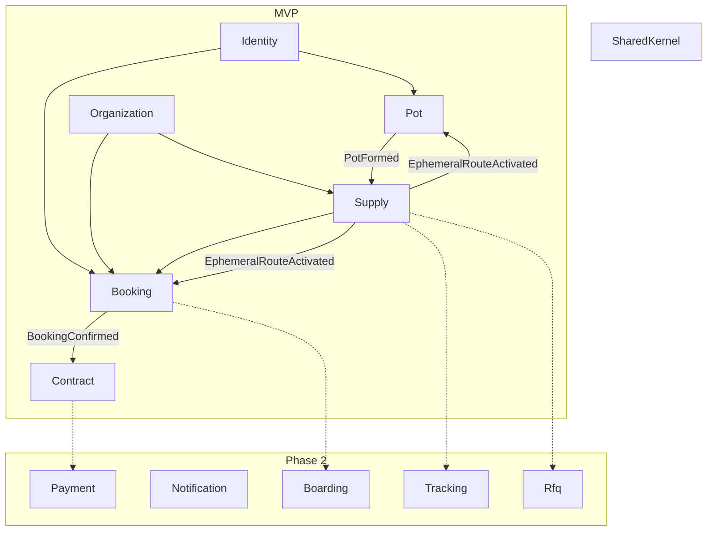
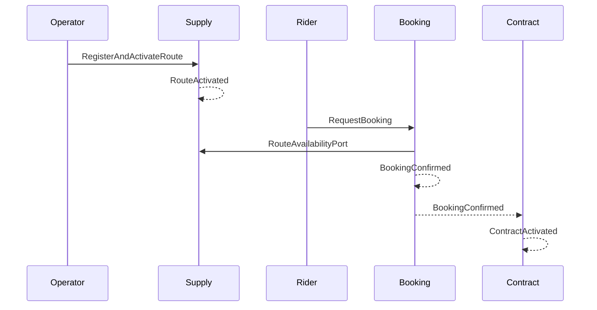
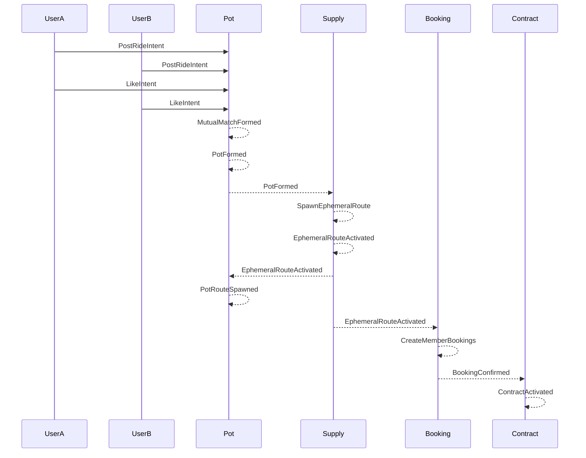

# Feroad 도메인 설계

| 항목 | 값 |
|------|-----|
| 문서 ID | `feroad-domain-design` |
| 상태 | `active` |
| 최종 검토 | 2026-06-29 |
| 대상 코드베이스 | [feroad-rest-api](/root/feroad-rest-api) |

## 목차

1. [개요](#1-개요)
2. [아키텍처 원칙](#2-아키텍처-원칙)
3. [바운디드 컨텍스트 맵](#3-바운디드-컨텍스트-맵)
4. [수요 경로](#4-수요-경로)
5. [Shared Kernel](#5-shared-kernel)
6. [바운디드 컨텍스트 상세](#6-바운디드-컨텍스트-상세)
7. [도메인 이벤트 카탈로그](#7-도메인-이벤트-카탈로그)
8. [API 표면 (개념)](#8-api-표면-개념)
9. [코드 레이아웃](#9-코드-레이아웃)
10. [유비쿼터스 언어](#10-유비쿼터스-언어)
11. [MVP 범위](#11-mvp-범위)
12. [검증 전략](#12-검증-전략)

---

## 1. 개요

Feroad(페로드)는 셔틀버스 운송 **중개** 플랫폼의 백엔드입니다. Feroad는 차량을 직접 운행하지 않으며, 이용자와 셔틀 업체 사이의 예약·계약을 중개합니다.

### 설계 전제

| 항목 | 결정 |
|------|------|
| 아키텍처 | Event-driven Architecture + Domain-Driven Design |
| Mobiall 관계 | 완전 신규 — mobiall-backend의 DDD/EDA 패턴만 참고 |
| 액터 | B2B2C — 개인 이용자, 기업/단체, 셔틀 업체, 플랫폼 운영자 |
| 비즈니스 비전 | 통합 마켓플레이스 (검색·비교·예약·결제) |
| MVP 범위 | 중개 핵심 — Identity, Organization, Supply, Pot, Booking, Contract |

### 수요 채널 (2경로)

| 채널 | 흐름 요약 |
|------|-----------|
| **A. 카탈로그** | 업체 등록 노선 → 이용자 직접 예약 → 중개 계약 |
| **B. Pot** | Tinder식 동행 매칭 → **1회성 노선 자동 생성** → 멤버 예약 → 중개 계약 |

---

## 2. 아키텍처 원칙

### 레이어 의존 방향

```
API → Application → Domain ← Infrastructure
```

### BC 간 통합 규칙

| 상황 | 허용 메커니즘 |
|------|---------------|
| 비동기 후속 처리 | Domain Event + Outbox |
| 동기 조회·검증 | ACL Port 또는 Read Model |
| 금지 | 타 BC의 Repository / Aggregate 직접 import |

### 이벤트 처리 (MVP 골격)

1. Aggregate가 도메인 이벤트 기록
2. `OutboxEventPublisher`가 outbox에 저장
3. `EventDispatcher`가 핸들러에 전달
4. 핸들러가 교차 BC 효과 반영

---

## 3. 바운디드 컨텍스트 맵

### MVP 컨텍스트



### ACL Port 요약

| Port | 제공 BC | 소비 BC | 용도 |
|------|---------|---------|------|
| `UserProfilePort` | Identity | Pot, Booking | 활성 사용자 검증 |
| `OperatorVerificationPort` | Organization | Supply | verified 업체만 카탈로그 노선 게시 |
| `CorporateMembershipPort` | Organization | Pot, Booking | 기업 소속 검증 |
| `RouteAvailabilityPort` | Supply | Booking | 좌석·스케줄 가용성 조회 |

### 이벤트 연동 요약

| 이벤트 | 발행 BC | 구독 BC | 효과 |
|--------|---------|---------|------|
| `PotFormed` | Pot | Supply | 1회성 Ephemeral Route 생성 |
| `EphemeralRouteActivated` | Supply | Pot, Booking | Pot `route_id` 반영, 멤버 예약 생성 |
| `BookingConfirmed` | Booking | Contract | 중개 계약 활성화 |
| `RouteActivated` | Supply | — | 카탈로그 예약 가능 (경로 A) |

---

## 4. 수요 경로

### 경로 A: 카탈로그 직접 예약



```
RouteActivated → BookingRequested → BookingConfirmed → ContractActivated
```

### 경로 B: Pot → 1회성 노선



```
RideIntentPosted → MutualMatchFormed → PotFormed
  → EphemeralRouteCreated → EphemeralRouteActivated
  → PotRouteSpawned
  → BookingRequested(source=pot) × N
  → BookingConfirmed → ContractActivated
  → EphemeralRouteCompleted → EphemeralRouteArchived
```

---

## 5. Shared Kernel

### 식별자

`UserId`, `OrganizationId`, `ShuttleId`, `RouteId`, `BookingId`, `ContractId`, `RideIntentId`, `PotId`, `MatchId`

### 값 객체

| 타입 | 용도 |
|------|------|
| `Money` | 요금 스냅샷 |
| `GeoPoint` | 출발·도착 좌표 |
| `GeoZone` | 권역 버킷 |
| `ServiceDate` | 이용일 |
| `TimeWindow` | 출발 시간창 |
| `Capacity` | 좌석·인원 상한 |
| `CorridorSignature` | Pot 출발·도착·시간 요약 |

### 이벤트 인프라

- `DomainEvent` trait
- `EventType` enum (전체 목록은 [§7](#7-도메인-이벤트-카탈로그) 참조)
- `OutboxEventPublisher` / `EventDispatcher`

---

## 6. 바운디드 컨텍스트 상세

### 6.1 Identity

**책임:** 인증, 사용자 프로필, 역할.

| Aggregate | 상태 전이 | 주요 이벤트 |
|-----------|-----------|-------------|
| `User` | `pending` → `active` → `suspended` | `UserRegistered`, `UserActivated` |

**역할:** `Rider`, `CorporateMember`, `OperatorAdmin`, `Driver`, `PlatformAdmin`

---

### 6.2 Organization

**책임:** 기업(수요)·셔틀 업체(공급)·플랫폼 조직 및 멤버십.

| Aggregate | 상태 전이 | 주요 이벤트 |
|-----------|-----------|-------------|
| `Organization` | `draft` → `pending_verification` → `verified` → `suspended` | `OrganizationCreated`, `OrganizationVerified` |
| `OrganizationMembership` | `invited` → `active` → `removed` | `MemberAdded`, `MemberRemoved` |

| `OrganizationType` | 설명 |
|--------------------|------|
| `Corporate` | 학교·회사 등 수요 조직 |
| `Operator` | 셔틀 운송 업체 |
| `Platform` | Feroad 운영 주체 |

**규칙:** 카탈로그 노선 게시는 `verified` 상태의 `Operator` 조직만 가능.

---

### 6.3 Supply

**책임:** 차량·노선·스케줄·정류장 관리. 카탈로그 공급 + Pot 유래 1회성 노선 생성.

#### Aggregate

| Aggregate | 상태 전이 | 주요 이벤트 |
|-----------|-----------|-------------|
| `Shuttle` | `draft` → `active` → `retired` | `ShuttleRegistered`, `ShuttleActivated` |
| `Route` | `draft` → `active` → `inactive` / `completed` → `archived` | `RouteCreated`, `RouteActivated` |
| `RouteSchedule` | Route 종속 | `ScheduleAdded` |
| `Stop` | Route 종속 | `StopAdded`, `StopRemoved` |

#### Route 분류

| `RouteOrigin` | `RouteType` | 카탈로그 노출 | 생성 주체 |
|---------------|-------------|---------------|-----------|
| `Catalog` | `Fixed` | O | Operator |
| `Catalog` | `Flexible` | O | Operator |
| `Pot` | `Ephemeral` | **X** | Supply (PotFormed 핸들러) |

#### Ephemeral Route (1회성 노선)

Pot 매칭 성립 시 **기존 카탈로그를 검색하지 않고** Pot 전용 노선을 새로 생성합니다.

| 항목 | 값 |
|------|-----|
| 트리거 | `PotFormed` 이벤트 |
| Command | `SpawnEphemeralRouteFromPot` |
| `pot_id` | 생성 원인 |
| `service_date` | Pot 공통 이용일 |
| `departure_time` | Pot 합의 출발 시각 |
| `stops` | 멤버별 `Pickup` + 개별/공통 `Dropoff` |
| `schedule` | 1회 운행 `RouteSchedule` |
| `capacity` | Pot `max_capacity` |
| `operator_org_id` | MVP: `None` — 2차 RFQ로 배정 |

**불변식**

- `pot_id`당 활성 Ephemeral Route는 최대 1개
- Ephemeral Route는 카탈로그·Discover API에 노출되지 않음
- Intent 스냅샷 기반으로만 생성 — 업체 수동 편집 불가
- `service_date` 경과 후 `active` → `archived`

---

### 6.4 Pot

**책임:** Tinder식 동행 매칭. 호환 Intent를 Pot으로 묶고, 성립 시 1회성 노선 생성을 트리거.

#### 용어

| 용어 | 설명 |
|------|------|
| RideIntent | 이용자 1명의 이동 카드 |
| Like | 다른 Intent에 관심 표시 |
| Match | 양방향 Like로 성립한 쌍 |
| Pot | 매칭된 이용자의 동행 그룹 |
| PotFormed | 최소 인원 충족 — 1회성 노선 생성 트리거 |

#### Aggregate: RideIntent

| 필드 | 설명 |
|------|------|
| `user_id` | 작성자 |
| `origin`, `destination` | 출발·도착 좌표 |
| `service_date`, `departure_time` | 이용일·희망 시각 |
| `passenger_count` | 본인 포함 인원 |
| `corporate_org_id` | 선택 — 기업 소속 시 |
| `pot_id` | 소속 Pot (매칭 전 `null`) |

| 상태 | 설명 |
|------|------|
| `open` | 탐색·Like 수신 중 |
| `matched` | Pot 편입 |
| `withdrawn` | 이용자 철회 |
| `expired` | 이용일 경과 |

#### Aggregate: Match

| 필드 | 설명 |
|------|------|
| `from_intent_id`, `to_intent_id` | Like 방향 |
| `status` | `pending` → `mutual` |

**불변식:** 자기 Intent Like 불가, `withdrawn`/`expired` 대상 Like 불가, `mutual` 쌍 중복 불가.

#### Aggregate: Pot

| 필드 | 설명 |
|------|------|
| `corridor` | `CorridorSignature` |
| `service_date`, `time_window` | 공통 일정 |
| `members` | `PotMember[]` |
| `min_members` | 성립 최소 인원 (기본 2) |
| `max_capacity` | 차량 수용 상한 |
| `route_id` | 생성된 1회성 노선 ID |

| 상태 | 설명 |
|------|------|
| `gathering` | 멤버 모집·매칭 중 |
| `formed` | 최소 인원 충족 |
| `spawning_route` | Supply가 1회성 노선 생성 중 |
| `route_spawned` | Ephemeral Route 활성화 완료 |
| `converted` | 멤버 예약·계약 완료 |
| `dissolved` | 해산 |
| `expired` | 이용일 경과 |

#### Domain Service: CompatibilityScorer

Discover 피드 호환 판정 (MVP):

| 조건 | 허용 |
|------|------|
| `service_date` | 동일 |
| `departure_time` | ±20분 |
| `origin`, `destination` | 각 700m 이내 |
| 인원 합 | `max_capacity` 이하 |

앱 노출: `compatibility_band` (`high` / `medium` / `low`)만 반환.

---

### 6.5 Booking

**책임:** 노선 참여·예약 lifecycle.

| Aggregate | 상태 전이 | 주요 이벤트 |
|-----------|-----------|-------------|
| `Booking` | `requested` → `pending_approval`* → `confirmed` → `cancelled` / `completed` | `BookingRequested`, `BookingConfirmed` |

\* `Catalog` + `Flexible`만 `pending_approval`. Pot 유래는 Ephemeral Route 활성화 후 자동 생성.

#### `booking_source`

| 값 | 설명 |
|----|------|
| `catalog` | 카탈로그 노선 직접 예약 |
| `pot` | Pot → Ephemeral Route → 멤버별 예약 |
| `corporate` | 기업 단체 등록 |

**Pot 연동**

- `EphemeralRouteActivated` 핸들러가 멤버마다 `Booking(source=pot, pot_id, route_id)` 생성
- 멤버별 pickup/dropoff stop 연결
- 카탈로그 노선과 독립 — 항상 신규 Ephemeral Route에 귀속

---

### 6.6 Contract

**책임:** Feroad 중개 계약 기록. 운송 계약이 아닌 **중개 조건**의 스냅샷.

| Aggregate | 상태 전이 | 주요 이벤트 |
|-----------|-----------|-------------|
| `BrokerageContract` | `draft` → `active` → `terminated` | `ContractDrafted`, `ContractActivated` |

| 필드 (스냅샷) | 설명 |
|---------------|------|
| `booking_id` | 원 예약 |
| `broker_role` | `feroad` |
| `brokerage_type` | `catalog` / `pot_ephemeral` |
| `operator_org_id` | 운송 업체 (Pot MVP는 nullable) |
| `rider_user_id` / `corporate_org_id` | 수요 주체 |
| `route_id` | 대상 노선 |
| `pot_id` | Pot 유래 시 |
| `fare_snapshot`, `terms_version` | 당시 조건 고정 |

**규칙:** `BookingConfirmed` 구독 → 계약 생성. MVP는 결제 없이 활성화 가능.

---

## 7. 도메인 이벤트 카탈로그

### Identity

| 이벤트 | 발행 시점 |
|--------|-----------|
| `UserRegistered` | 가입 |
| `UserActivated` | 활성화 |

### Organization

| 이벤트 | 발행 시점 |
|--------|-----------|
| `OrganizationCreated` | 조직 생성 |
| `OrganizationVerified` | 검증 완료 |
| `MemberAdded` | 멤버 추가 |

### Supply

| 이벤트 | 발행 시점 | 주요 구독자 |
|--------|-----------|-------------|
| `RouteActivated` | 카탈로그 노선 활성화 | — |
| `EphemeralRouteCreated` | Pot 유래 노선 생성 | — |
| `EphemeralRouteActivated` | 1회성 노선 활성화 | Pot, Booking, RFQ(2차) |
| `EphemeralRouteCompleted` | 운행 완료 | — |
| `EphemeralRouteArchived` | 1회성 노선 종료 | — |

### Pot

| 이벤트 | 발행 시점 | 주요 구독자 |
|--------|-----------|-------------|
| `RideIntentPosted` | Intent 등록 | — |
| `IntentLiked` | Like 전송 | — |
| `MutualMatchFormed` | 양방향 Like | — |
| `PotCreated` | Pot 생성 | — |
| `PotMemberJoined` | 멤버 추가 | — |
| `PotFormed` | 최소 인원 충족 | **Supply** |
| `PotRouteSpawned` | `route_id` 반영 | — |
| `PotConverted` | 예약·계약 완료 | — |
| `PotDissolved` | 해산 | — |

### Booking

| 이벤트 | 발행 시점 | 주요 구독자 |
|--------|-----------|-------------|
| `BookingRequested` | 예약 요청 | — |
| `BookingConfirmed` | 예약 확정 | **Contract** |

### Contract

| 이벤트 | 발행 시점 |
|--------|-----------|
| `ContractDrafted` | 계약 초안 |
| `ContractActivated` | 계약 활성 |

---

## 8. API 표면 (개념)

### 공통

| Method | Path | 설명 |
|--------|------|------|
| GET | `/api/v1/health` | 헬스체크 |

### Pot

| Method | Path | 설명 |
|--------|------|------|
| POST | `/api/v1/pot/intents` | RideIntent 등록 |
| GET | `/api/v1/pot/intents/discover` | 호환 Intent 피드 |
| POST | `/api/v1/pot/intents/{id}/like` | Like |
| POST | `/api/v1/pot/intents/{id}/pass` | Pass |
| DELETE | `/api/v1/pot/intents/{id}` | Intent 철회 |
| GET | `/api/v1/pot/pots/{id}` | Pot 상세 |
| GET | `/api/v1/pot/pots/{id}/route` | 연결된 1회성 노선 |

### Supply / Booking (카탈로그 경로 — 구현 단계에서 상세화)

| Method | Path | 설명 |
|--------|------|------|
| GET | `/api/v1/routes` | 카탈로그 노선 목록 |
| POST | `/api/v1/routes/{id}/bookings` | 카탈로그 예약 |

---

## 9. 코드 레이아웃

```
src/
├── shared_kernel/
│   ├── ids.rs
│   ├── value_objects.rs
│   ├── domain_event.rs
│   └── event_types.rs
├── identity/
├── organization/
├── supply/
│   ├── domain/
│   ├── application/
│   │   └── command/spawn_ephemeral_route_from_pot.rs
│   └── infrastructure/
│       └── event_handlers/pot_formed_handler.rs
├── pot/
│   ├── domain/
│   │   ├── model/          # ride_intent, match_record, pot
│   │   └── service/compatibility_scorer.rs
│   ├── application/
│   └── infrastructure/
│       └── event_handlers/pot_route_spawned_handler.rs
├── booking/
│   └── infrastructure/
│       └── event_handlers/ephemeral_route_activated_handler.rs
├── contract/
│   └── infrastructure/
│       └── event_handlers/booking_confirmed_handler.rs
├── api/v1/
└── infrastructure/
    ├── outbox/
    ├── event_dispatcher.rs
    └── adapter_dispatch.rs
```

**BC 내부 공통 구조**

```
{bc}/
├── domain/       # model, repository traits, events
├── application/  # command/, query/
└── infrastructure/  # repository impl, event_handlers/
```

---

## 10. 유비쿼터스 언어

| 한글 | 영문 | BC |
|------|------|-----|
| 이용자 | User / Rider | Identity |
| 셔틀 업체 | Operator Organization | Organization |
| 기업/단체 | Corporate Organization | Organization |
| 차량 | Shuttle | Supply |
| 노선 | Route | Supply |
| 1회성 노선 | Ephemeral Route | Supply |
| 노선 출처 | RouteOrigin | Supply |
| 이동 카드 | RideIntent | Pot |
| 관심 표시 | Like | Pot |
| 매칭 | Match | Pot |
| 동행 그룹 | Pot | Pot |
| 동행 성립 | PotFormed | Pot |
| 예약 | Booking | Booking |
| 중개 계약 | BrokerageContract | Contract |
| 중개 수수료 | BrokerageFee | Contract (2차) |

---

## 11. MVP 범위

### 포함

| 영역 | 내용 |
|------|------|
| BC | Identity, Organization, Supply, Pot, Booking, Contract |
| 수요 경로 A | 카탈로그 노선 → 예약 → 계약 |
| 수요 경로 B | Pot 매칭 → Ephemeral Route → 예약 → 계약 |
| 이벤트 인프라 | Outbox + Dispatcher 골격 |

### 제외 (Phase 2)

| 영역 | 비고 |
|------|------|
| Payment | `ContractActivated` → `PaymentRequested` 훅만 예약 |
| Notification, Boarding, Tracking | 이벤트 구독 지점만 정의 |
| RFQ / 업체 입찰 | `EphemeralRouteActivated` 후 업체 배정 |
| Mobiall급 Match Pool, Joint Request, Trip Crew | — |
| 관리자 SSR | — |

---

## 12. 검증 전략

| 대상 | 검증 내용 |
|------|-----------|
| RideIntent / Match / Pot | 상태 전이, Like 불변식 |
| Ephemeral Route | `pot_id`당 1개, 비노출, archive |
| 이벤트 체인 | `PotFormed` → `EphemeralRouteActivated` → `BookingConfirmed` → `ContractActivated` |
| BC 경계 | 타 BC repository import 없음 |
| CompatibilityScorer | 시간·거리·인원 호환 판정 |

---

## 변경 이력

| 날짜 | 변경 |
|------|------|
| 2026-06-29 | 초안 — 6 BC, 카탈로그 + Pot 2경로 |
| 2026-06-29 | Pot 매칭 시 Ephemeral Route 자동 생성 flow 반영 |
| 2026-06-29 | 문서 구조 정리 — 목차, 이벤트 카탈로그, ACL 표 통합 |